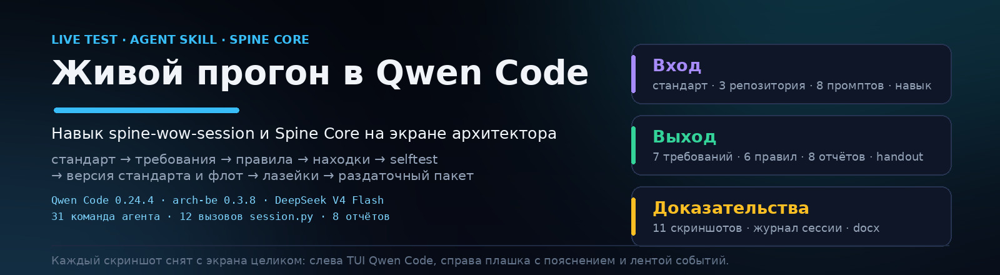
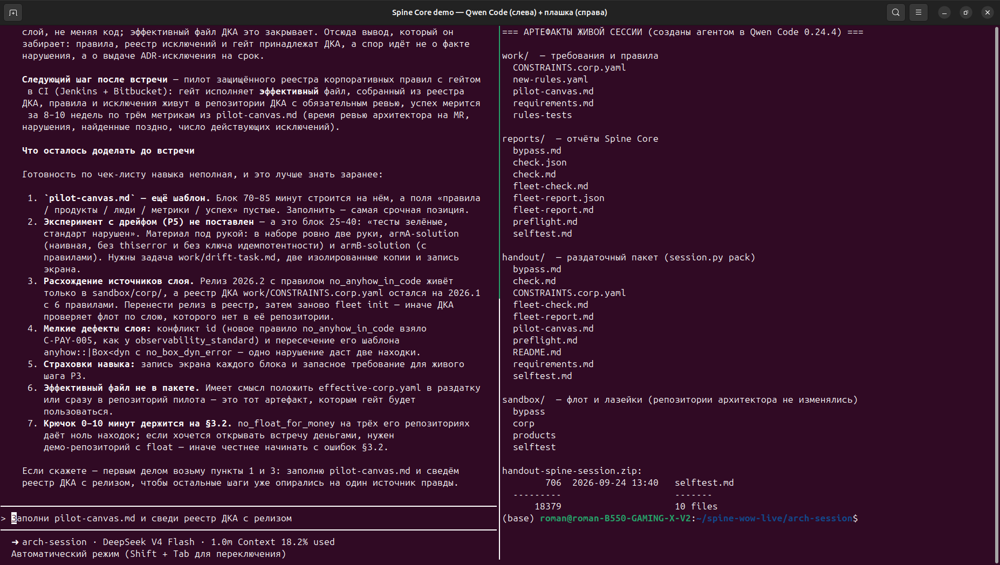
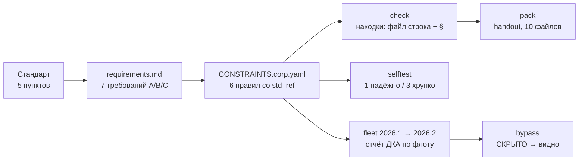

<div align="center">
  
</div>

<h1 align="center">spine-wow-session-live-test</h1>

<p align="center">
  <b>Живой прогон навыка <a href="https://github.com/romannekrasovaillm/spine-wow-session">spine-wow-session</a>
  в TUI свежего Qwen Code:<br>стандарт архитектора становится проверяемым, находки даёт Spine Core,
  а не языковая модель.</b>
</p>

<p align="center">
  <a href="LICENSE"></a>
  
  
  
  
  
</p>

---

> ### Что доказывает этот прогон
>
> Архитектор садится за Qwen Code и вводит промпты словами — без точных команд.
> Агент сам находит навык, сам разбирает его стандарт на требования, сам генерирует
> проверяемые правила и сам вызывает механику Spine Core. Через 8 шагов на экране —
> находки в его репозиториях с указанием файла, строки и **пункта его стандарта**,
> версия корпоративного слоя с отчётом по флоту, честный список хрупких правил
> и раздаточный пакет.

**Факты прогона:** 31 команда агента · 12 вызовов `session.py` · 7 требований · 6 правил ·
3 находки · 1 надёжное и 3 хрупких правила · 8 отчётов Spine Core · 11 скриншотов · 150 файлов в пакете.

**Что внутри репозитория:** **два прогона** (промпты-шаблоны и короткие фразы архитектора),
полный пакет «вход → выход → доказательства» для каждого, отдельный альбом визуализаций
и итоговый отчёт в `.docx`.

---

## Содержание

| Раздел | О чём |
|---|---|
| [1. Что проверялось и что подтверждено](#1-что-проверялось-и-что-подтверждено) | версии, условия, вердикт |
| [2. Как выглядел экран](#2-как-выглядел-экран) | ключевые кадры: находки, артефакты |
| [3. Визуализации отдельно](#3-визуализации-отдельно) | альбом из 11 кадров, `VISUAL.md` |
| [4. Маршрут прогона](#4-маршрут-прогона-8-шагов) | 8 шагов от стандарта до пакета |
| [5. Второй прогон: короткие фразы](#5-второй-прогон-короткие-фразы) | 4 реплики живой речи вместо 8 промптов-шаблонов |
| [6. Что в пакете](#6-что-в-пакете) | вход, выход, доказательства |
| [7. Доказательства из журнала](#7-доказательства-из-журнала) | 31 команда, 12 вызовов оркестратора |
| [8. Что нашёл сам прогон](#8-что-нашёл-сам-прогон) | 8 дефектов демо-материалов |
| [9. Как воспроизвести](#9-как-воспроизвести) | команды и требования |
| [10. Ограничения и честность](#10-ограничения-и-честность) | что не проверялось |
| [11. English summary](#11-english-summary) | краткое описание |

---

## 1. Что проверялось и что подтверждено

| Параметр | Значение |
|---|---|
| Проверяемый навык | [spine-wow-session](https://github.com/romannekrasovaillm/spine-wow-session) — 90-минутная сессия Spine Core для корпоративного архитектора |
| Харнесс | Qwen Code **0.24.4** (перед прогоном обновлён с 0.24.2) |
| Механика проверок | Spine Core, бинарь `arch-be` **0.3.8** |
| Модель | DeepSeek V4 Flash (штатная конфигурация машины) |
| Стандарт | «Стандарт платёжного ядра v2» — демо-экспорт Confluence, 5 пунктов (11 строк) |
| Репозитории | три учебных Rust-репозитория из публичного Spine |
| Ввод промптов | живой TUI, словами, без подсказки точных команд |

| Утверждение | Статус |
|---|---|
| Навык устанавливается в свежий Qwen Code и активируется сам | **подтверждено** (S0) |
| Агент следует процедурам навыка, а не пересказывает их | **подтверждено** (S1–S7, 12 вызовов `session.py`) |
| Spine Core работает при вызове из Qwen Code | **подтверждено** (8 отчётов механики) |
| Находки прослеживаются до пунктов стандарта | **подтверждено** (`std_ref` в каждой находке) |
| Навык останавливается на решение человека | **подтверждено** (2 вопроса с вариантами) |
| Навык не подгоняет результат под зелёный | **подтверждено** (3 правила оставлены «хрупко») |
| Лазейки закрываются эффективным файлом ДКА | **подтверждено** (`bypass`: «СКРЫТО → видно») |
| Промышленная готовность контура ДКА | **не проверялось** (прогон учебный) |
| Полный 90-минутный сценарий встречи | **не проверялось** (живые блоки P3 и P5 не отыгрывались) |

---

## 2. Как выглядел экран

Экран собран из двух панелей одного окна терминала: слева — живая сессия Qwen Code,
справа — плашка с объяснением и лентой событий. Так зритель одновременно видит,
**как** агент работает и **что** это значит.

**Находки Spine Core, полученные из Qwen Code:** репозиторий, правило, пункт стандарта,
файл:строка, уровень:


**Артефакты после сессии:** `work/`, `reports/`, `handout/`, `sandbox/` и содержимое архива:



---

## 3. Визуализации отдельно

Альбом визуализаций вынесен в отдельный документ — **[VISUAL.md](VISUAL.md)**: 11 кадров
с пояснением, что именно доказывает каждый.

| Шаг | Кадр | Что на нём |
|---|---|---|
| S0 | [02-skill-visible.png](visual/02-skill-visible.png) | Qwen Code называет навык и его 12 команд |
| S1 | [03-requirements.png](visual/03-requirements.png) | 7 требований с классами A/B/C и 6 неоднозначностей |
| S2 | [04-rules.png](visual/04-rules.png) | 6 правил со ссылками на пункты стандарта |
| S3 | [05-preflight-findings.png](visual/05-preflight-findings.png) | находки `arch-be`: правило, §, файл:строка |
| S4 | [06-selftest-reliability.png](visual/06-selftest-reliability.png) | 1 надёжное, 3 хрупких правила |
| S5 | [07-fleet-version.png](visual/07-fleet-version.png) | версия слоя `2026.1 → 2026.2` и флот |
| S6 | [08-bypass-and-effective.png](visual/08-bypass-and-effective.png) | лазейки «СКРЫТО → видно» |
| S7 | [09-handout-pack.png](visual/09-handout-pack.png) | раздаточный пакет и незакрытые пункты |
| — | [10-artifacts-tree.png](visual/10-artifacts-tree.png) | состав артефактов после прогона |

Все кадры — реальные снимки экрана X11 (окно 1854×1048, `mss` + `xdotool`), без монтажа.

---

## 4. Маршрут прогона: 8 шагов



| Шаг | Промпт архитектора (сокращённо) | Что сделал агент |
|---|---|---|
| S0 | «какие навыки тебе доступны» | нашёл навык, перечислил 12 команд |
| S1 | «разбери стандарт на требования, заполни `work/requirements.md`» | 7 требований, классы A/B/C, 6 неоднозначностей |
| S2 | «требования класса A → `CONSTRAINTS.corp.yaml` со `std_ref`» | 6 правил; 2 вопроса архитектору |
| S3 | «покажи preflight, убери ложные срабатывания, покажи `check --top 10`» | 3 находки, все со ссылкой на пункт |
| S4 | «проверь надёжность правил, правила не ослабляй» | `selftest`: 1 надёжное, 3 хрупких |
| S5 | «покажи «стандарт как продукт»: версия и флот» | `fleet init/bump/report/repin` |
| S6 | «покажи три лазейки и эффективный файл ДКА» | «СКРЫТО → видно» |
| S7 | «собери раздаточный пакет и подведи итог» | `handout/` + честный список пробелов |

---

## 5. Второй прогон: короткие фразы

Первый прогон получился с методической оговоркой: в TUI вставлялись **промпт-шаблоны P1/P2
из самого навыка**, а не речь человека. Второй прогон закрывает именно это — четыре короткие
реплики живой речи и намеренно пустая рабочая папка (в `work/` только шаблоны).

```
1. Мой стандарт лежит в context/standard/, репозитории перечислены в session.yaml.
   Покажи, что у меня нарушается.

2. Хочу, чтобы это проверялось в CI, а не только сегодня.
   И проверь, что правилам вообще можно доверять.

3. Стандарт будет меняться. Как выпустить новую версию и увидеть, кто её ещё не применил?
   И что команда сможет обойти?

4. Собери раздатку к встрече и честно скажи, что ещё не готово.
```

Первая же фраза развернулась в полный цикл подготовки — стандарт → 7 требований с классами A/B/C →
7 правил со `std_ref` → `preflight` → `check` с находками:


| Параметр | Прогон 1: промпты-шаблоны | Прогон 2: короткие фразы |
|---|---|---|
| Реплик архитектора | 8 длинных | **4 короткие** |
| Кто выбирал процедуру | подсказано в промпте | **агент сам** по `SKILL.md` |
| Отчётов механики | 8 | **13** |
| Вызовов `session.py` | 12 | **20** |
| Контур CI (`Jenkinsfile`, `gate.sh`) | нет | **есть** |
| `pilot-canvas.md` | остался шаблоном | **заполнен** |
| Самоисправление вердикта правила | нет | **есть** («надёжно» → «хрупко») |

Вывод: длинные промпты были артефактом тестирования, а не требованием навыка — навык
включается с обычной речи, и результат получается даже богаче.

Полное сравнение — [`RUNS.md`](RUNS.md), пакет второго прогона — [`package-2-korotkie-frazy/`](package-2-korotkie-frazy),
кадры — [альбом 2](VISUAL.md#второй-прогон-короткие-фразы).

---

## 6. Что в пакете

Всё лежит в каталоге [`package/`](package) — целиком, как собиралось на машине.

```
package/                       прогон 1: промпты-шаблоны (8 шагов)
├── README.md                  карта пакета: вход → выход → доказательства
├── MANIFEST.sha256            контрольные суммы 150 файлов
├── 01-ВХОД/                   с чем работали
│   ├── 01-навык/              испытуемый навык (SKILL.md, references, scripts, assets)
│   ├── 02-стандарт/           демо-экспорт стандарта (11 строк)
│   ├── 03-контекст/           session.yaml, exceptions.yaml
│   ├── 04-репозитории/        три учебных Rust-репозитория
│   ├── 05-промпты-архитектора/ промпты s0…s7, введённые в TUI
│   └── 06-окружение/          версии, железо, исходное состояние
├── 02-ВЫХОД/                  что получилось
│   ├── work/                  requirements.md, CONSTRAINTS.corp.yaml, rules-tests, pilot-canvas
│   ├── reports/               preflight, check, selftest, fleet-check, fleet-report, bypass
│   ├── sandbox/               флот, лазейки, эффективный файл ДКА
│   └── handout/ + zip         раздаточный пакет, 10 файлов
└── 03-ДОКАЗАТЕЛЬСТВА/
    ├── screenshots/           11 кадров экрана (оригиналы)
    ├── qwen-session.jsonl     журнал сессии Qwen Code
    ├── commands.txt           31 команда агента
    ├── step-transcripts/      расшифровка шагов s0…s7
    ├── pane/                  текстовые снимки панелей
    └── Отчет_…docx            итоговый отчёт (10 скриншотов, 9 таблиц)

package-2-korotkie-frazy/      прогон 2: короткие фразы (4 реплики)
├── README.md                  карта второго прогона и что он дал сверх первого
├── 01-ВХОД/                   четыре реплики архитектора, стандарт, контекст, окружение
├── 02-ВЫХОД/                  work/ (включая work/ci), reports/ (13), sandbox/, handout/ + архив
└── 03-ДОКАЗАТЕЛЬСТВА/         скриншоты, журнал сессии, командная выгрузка, расшифровки

visual/                        11 кадров первого прогона
visual-2/                      5 кадров второго прогона
VISUAL.md                      альбом визуализаций обоих прогонов
RUNS.md                        сравнение прогонов: длинные промпты против коротких фраз
```

Описание каждого объекта — в [`package/README.md`](package/README.md)
и [`package-2-korotkie-frazy/README.md`](package-2-korotkie-frazy/README.md).

---

## 7. Доказательства из журнала

Источник — журнал сессии Qwen Code (`package/03-ДОКАЗАТЕЛЬСТВА/qwen-session.jsonl`),
а не текст ответов модели:

| Инструмент агента | Вызовов | Что подтверждает |
|---|---|---|
| `run_shell_command` | 31 | агент реально исполнял команды |
| из них `session.py` | 12 | `preflight`×3, `check`×3, `selftest`×2, `fleet init/bump/report`, `bypass`, `pack` |
| `read_file` | 26 | чтение стандарта, контекста, отчётов |
| `write_file` / `edit` | 8 / 3 | созданы требования, правила и примеры bad/good/bypass |
| `skill` | 1 | явная активация навыка |
| `ask_user_question` | 1 | остановка на решение архитектора |

Пример результата механики (фрагмент `package/02-ВЫХОД/reports/check.md`):

```
| Репозиторий    | Правило              | Пункт стандарта                  | Где             | Уровень |
| payments-arm-a | thiserror_for_errors | Стандарт платёжного ядра v2 §3.2 | src/error.rs:50 | warn    |
| payments-arm-a | thiserror_for_errors | Стандарт платёжного ядра v2 §3.2 | src/error.rs:78 | warn    |
| cards-product  | tech_radar_hold      | Стандарт платёжного ядра v2 §5.1 | Cargo.toml:10   | warn    |
```

Пример честной части (`bypass`): три лазейки продукта скрывают нарушение от продуктового
файла и **все три видны** при проверке по эффективному файлу ДКА.

---

## 8. Что нашёл сам прогон

Найденные дефекты относятся к демо-материалам навыка, а не к механике Spine Core:

1. демо-правило `new-rules.yaml` заняло `id: C-PAY-005`, который уже был у `observability_standard`;
2. шаблон `anyhow::|Box<dyn` пересекается с правилом `no_box_dyn_error` — двойные находки;
3. реестр ДКА (`work/`, 2026.1) и песочница флота (`sandbox/`, 2026.2) разошлись версиями;
4. `pilot-canvas.md` остался шаблоном — блок 70–85 минут встречи пока пуст;
5. эксперимент с дрейфом (P5) не поставлен;
6. `effective-corp.yaml` не попадает в раздаточный пакет;
7. крючок встречи держится на §3.2 (правило §2.1 на учебных репозиториях даёт ноль находок);
8. агент читал исходники Spine (`src/control.rs`), хотя для роли потребителя достаточно бинаря.

---

## 9. Как воспроизвести

Нужны: `arch-be` 0.3.8+, Python 3.9+ с PyYAML, Qwen Code и клон публичного Spine
с учебными репозиториями.

```bash
# 1. навык и рабочая папка сессии
git clone https://github.com/romannekrasovaillm/spine-wow-session.git
python3 spine-wow-session/spine-wow-session/scripts/session.py init ~/spine-session-demo

# 2. положить стандарт и прописать контекст
cp spine-wow-session/spine-wow-session/assets/demo/payment-core-standard.md ~/spine-session-demo/context/standard/
#    в ~/spine-session-demo/context/session.yaml: standard.files, repos (3 учебных репозитория),
#    spine.arch_be = путь к arch-be

# 3. установить навык в Qwen Code и запустить TUI в рабочей папке сессии
mkdir -p ~/spine-session-demo/.qwen/skills
cp -r spine-wow-session/spine-wow-session ~/spine-session-demo/.qwen/skills/
cd ~/spine-session-demo && qwen

# 4. дальше — промпты архитектора из package/01-ВХОД/05-промпты-архитектора/ (s0…s7)
```

Быстрая проверка без своего стандарта — репетиция на демо-данных:

```bash
python3 spine-wow-session/spine-wow-session/scripts/session.py init ~/spine-rehearsal --demo ~/spine-bank
cd ~/spine-rehearsal && python3 <skill>/scripts/session.py preflight
```

---

## 10. Ограничения и честность

* **Прогон учебный.** Демо-стандарт платёжного ядра и три учебных репозитория. Числа описывают
  репетицию, а не реальную команду: принимать по ним решения нельзя.
* **Промышленная готовность не проверялась** — это отдельный вопрос пилота, а не этого испытания.
* **Полный сценарий встречи не отыгран:** шаги подготовки и разбора пройдены, живые блоки
  (P3 «архитектор сам пишет правило» и P5 «дрейф кодового агента») — нет.
* **Режим подтверждений Qwen Code — автоматический**, но агент всё равно дважды остановился
  и спросил человека.
* **Модель и версии фиксированы** (Qwen Code 0.24.4, `arch-be` 0.3.8, DeepSeek V4 Flash):
  на других версиях числа прогона будут другими.

---

## 11. English summary

**spine-wow-session-live-test** is a complete record of a live test: the
[spine-wow-session](https://github.com/romannekrasovaillm/spine-wow-session) Agent Skill was
installed into a fresh Qwen Code 0.24.4 and driven from its TUI by prompts written the way an
architect would type them.

The agent found the skill on its own, turned a Confluence-style standard into 7 requirements with
verifiability classes, generated 6 corporate rules carrying `std_ref` pointers to standard clauses,
ran Spine Core (`arch-be` 0.3.8) to get 3 findings with `file:line` and clause references, checked
rule reliability (1 robust, 3 bypassable), released a new version of the corporate layer
(`2026.1 → 2026.2`) with a fleet report, demonstrated that three product-side loopholes hide
violations unless the gate checks the effective corporate file, and packed a handout.

Evidence comes from the session journal, not from the model's prose: 31 shell commands,
12 `session.py` invocations, 11 screenshots, 8 Spine Core reports. The repository ships the whole
package — input, output, evidence — plus a separate visualization album in [VISUAL.md](VISUAL.md). A second run repeats the test with four short human-style sentences instead of the skill's own prompt templates and shows the agent reaching the same procedures on its own — see [RUNS.md](RUNS.md).

---

## Лицензия

[MIT](LICENSE) © 2026 Roman Nekrasov.

Материалы прогона можно свободно использовать как образец: как выглядит живое испытание навыка,
какие доказательства собирать и какие вопросы задавать механике.
