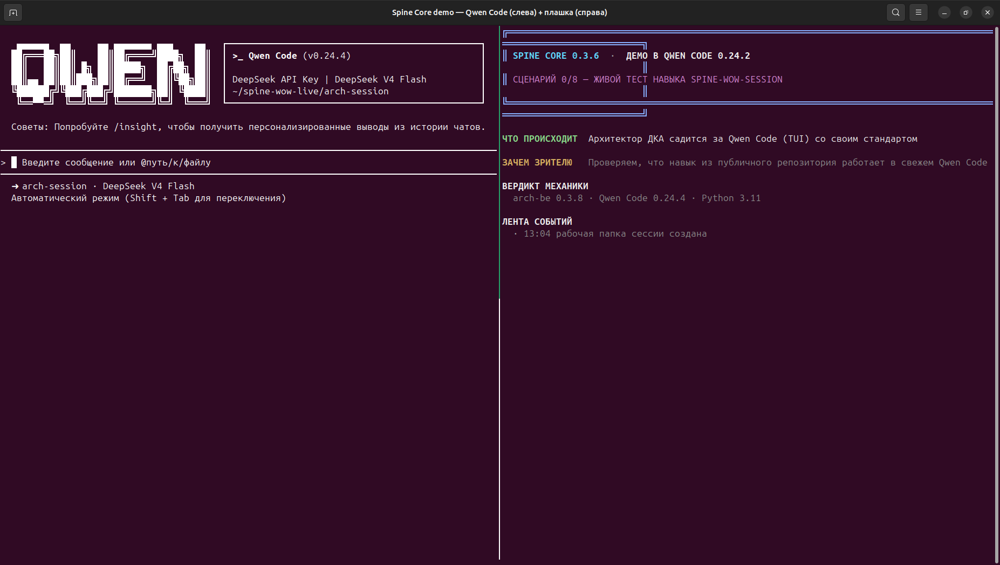
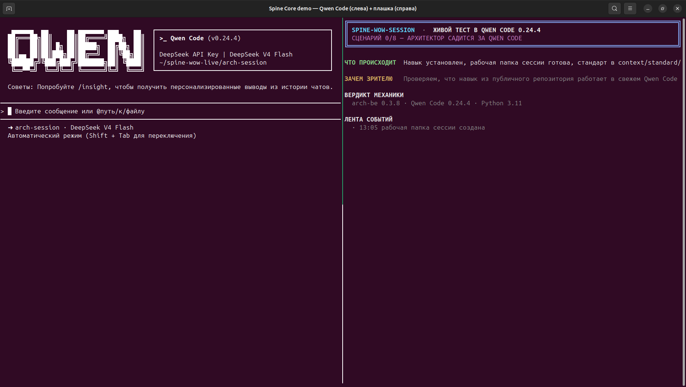
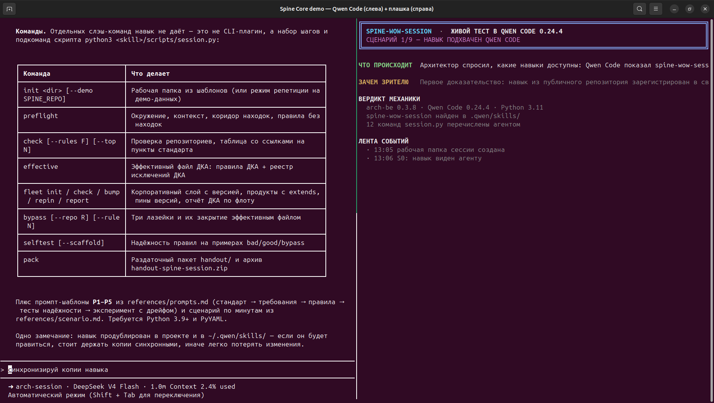
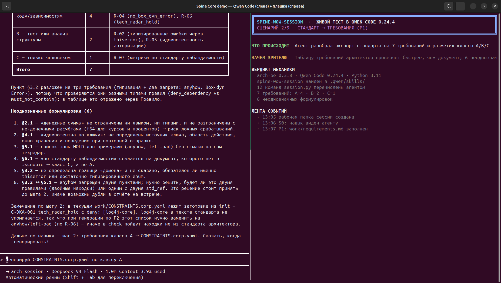
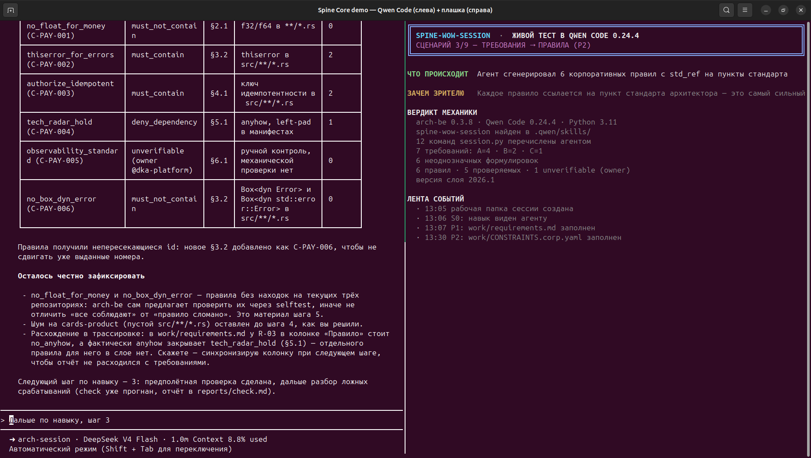
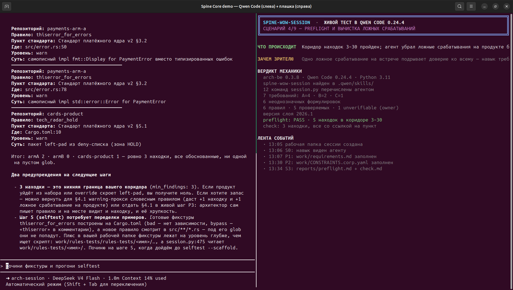
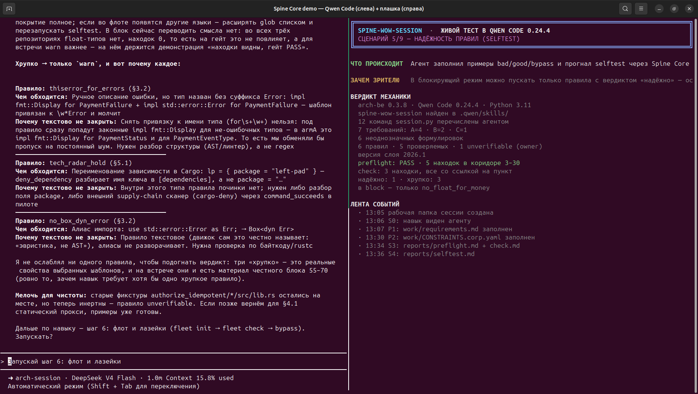
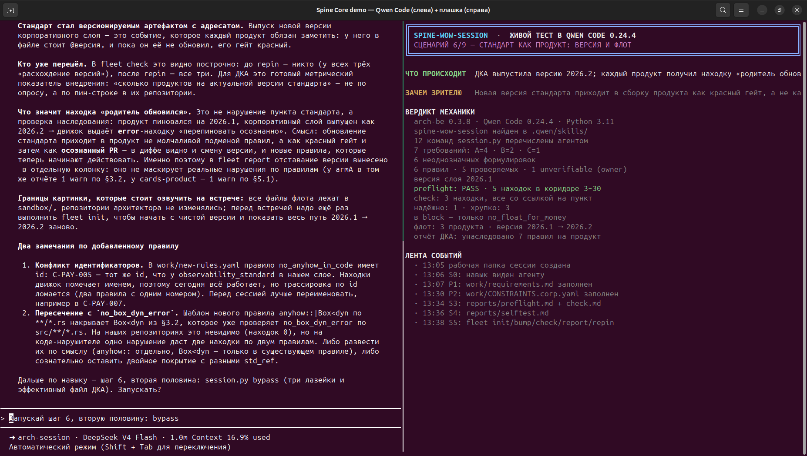
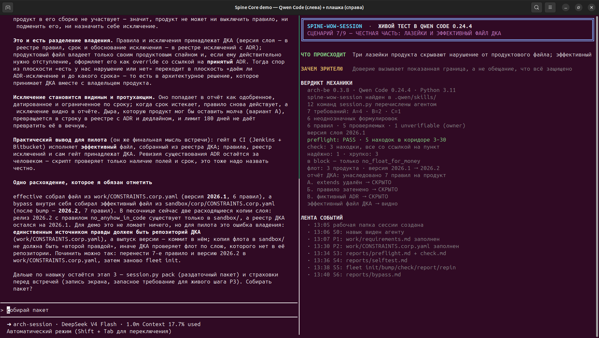
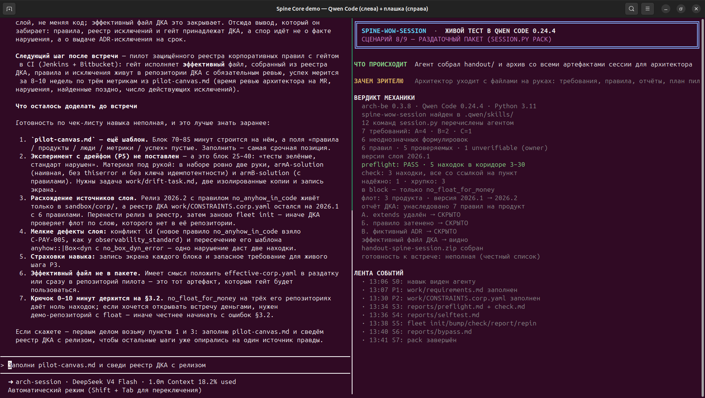

# Визуализации живого прогона

Отдельный альбом скриншотов по пакету живого прогона: 11 кадров, снятых прямо с экрана
во время сессии. На каждом кадре — **обе половины рабочего места одновременно**:

* **слева** — живой TUI Qwen Code: что агент читал, что писал, какие команды запускал
  и что при этом отвечала механика Spine Core;
* **справа** — плашка: номер шага, «что происходит», «зачем зрителю», «вердикт механики»
  и лента событий.

Оригиналы в полном размере лежат в пакете: `package/03-ДОКАЗАТЕЛЬСТВА/screenshots/`.
Кадры снимались с окна терминала 1854×1048 (X11, `mss` + `xdotool`), без монтажа и
доретуши — поэтому по ним можно проверять каждую цифру отчёта.

---

## 00. Qwen Code запущен в рабочей папке сессии

Первый кадр: TUI Qwen Code 0.24.4 открыт в `arch-session`, статусная строка показывает модель
DeepSeek V4 Flash и автоматический режим подтверждений. Ещё ничего не сделано — это точка отсчёта.

---

## 01. Экран собран: Qwen слева, плашка справа

Плашка показывает шаг 0/9, версии (`arch-be 0.3.8 · Qwen Code 0.24.4 · Python 3.11`) и первое
событие ленты. Дальше на каждом шаге плашка обновляется — по ней видно хронику прогона.

---

## 02. S0 — навык виден агенту

Архитектор спросил, какие навыки доступны. Qwen Code назвал `spine-wow-session`, перечислил
12 команд оркестратора `session.py`, промпты P1–P5 и сценарий на 90 минут. Это первое
доказательство: навык из публичного репозитория зарегистрирован и подхватывается сам.

---

## 03. S1 — стандарт превращается в требования

Агент разобрал экспорт стандарта на 7 требований с классами проверяемости A/B/C
(A — 4, B — 2, C — 1) и отдельно выписал 6 неоднозначных формулировок самого стандарта.
Именно этот список показывает архитектору, какие пункты стандарта нельзя механизировать
без уточнения.

---

## 04. S2 — требования становятся проверяемыми правилами

6 корпоративных правил (`C-PAY-001…C-PAY-006`) со ссылками `std_ref` на пункты стандарта
(§2.1, §3.2, §4.1, §5.1, §6.1), `severity: warn` и одним `unverifiable` с владельцем.
На этом шаге агент дважды остановился и задал архитектору вопрос с вариантами — это видно
в журнале сессии (инструмент `ask_user_question`).

---

## 05. S3 — находки Spine Core со ссылками на пункты стандарта

Главный кадр демонстрации: слева механика выдаёт находки с репозиторием, правилом,
**пунктом стандарта**, файлом и строкой (`src/error.rs:50`, `Cargo.toml:10`) и уровнем `warn`;
справа плашка объясняет, что коридор находок 3–30 пройден и ложные срабатывания вычищены.
Это результат работы `arch-be control check --no-exec`, вызванного из Qwen Code.

---

## 06. S4 — надёжность правил: что можно пускать в блокирующий режим

`selftest` на примерах bad/good/bypass: одно правило «надёжно», три «хрупко: обходится».
Агент не стал ослаблять правила ради зелёного результата, а объяснил каждый обход —
на этом и держится честный блок встречи.

---

## 07. S5 — стандарт как продукт: версия и флот

ДКА выпустила версию корпоративного слоя `2026.1 → 2026.2`; каждый продукт получил находку
«родитель обновился — перепиновать осознанно», после перепина — PASS. Отдельно видно, что
файлы флота живут в `sandbox/`, а репозитории архитектора не изменялись.

---

## 08. S6 — честная часть: лазейки и эффективный файл ДКА

Три лазейки продукта (удалённый `extends`, затенённое правило, исключение с несуществующим ADR)
скрывают нарушение, если проверять по продуктовому файлу, — и **все три видны** при проверке
по эффективному файлу ДКА. Вывод для пилота: правила, реестр исключений и гейт принадлежат ДКА.

---

## 09. S7 — раздаточный пакет и незакрытые пункты

`session.py pack` собрал `handout/` из 10 файлов и архив. Вместо бодрого итога агент выдал
честный список того, что к встрече ещё не готово: пустой `pilot-canvas.md`, не поставленный
эксперимент с дрейфом, расхождение версий реестра и песочницы, конфликт `id` и другие.

---

## 10. Артефакты сессии после прогона

Финальный кадр: слева — итог сессии в TUI, справа — фактический состав рабочей папки
(`work/`, `reports/`, `handout/`, `sandbox/`) и содержимое `handout-spine-session.zip`
(10 файлов, 18 379 байт). Здесь же видно, что песочница не тронула репозитории архитектора.

---

## Как эти кадры связаны с отчётом

| Кадр | Раздел отчёта |
|---|---|
| 02, 03, 04 | §5.1–5.3 (навык, требования, правила) |
| 05, 06 | §5.4–5.5 (preflight, находки, надёжность правил) |
| 07, 08 | §5.6–5.7 (версия и флот, лазейки) |
| 09, 10 | §5.8 и §6 (пакет, доказательства) |

Итоговый документ со всеми кадрами и таблицами — `package/03-ДОКАЗАТЕЛЬСТВА/Отчет_живой_тест_spine-wow-session_в_QwenCode.docx`.
