# Визуализации живого прогона

Отдельный альбом скриншотов: **11 кадров первого прогона** (промпты-шаблоны) и
**5 кадров второго прогона** (короткие фразы архитектора, см. [RUNS.md](RUNS.md)).
Все сняты прямо с экрана во время сессии. На каждом кадре — **обе половины рабочего места
одновременно**:

* **слева** — живой TUI Qwen Code: что агент читал, что писал, какие команды запускал
  и что при этом отвечала механика Spine Core;
* **справа** — плашка: номер шага, «что происходит», «зачем зрителю», «вердикт механики»
  и лента событий.

Оригиналы в полном размере лежат в пакете: `package/03-ДОКАЗАТЕЛЬСТВА/screenshots/`.
Кадры снимались с окна терминала 1854×1048 (X11, `mss` + `xdotool`), без монтажа и
доретуши — поэтому по ним можно проверять каждую цифру отчёта.

---

## 00. Qwen Code запущен в рабочей папке сессии

Первый кадр: TUI Qwen Code 0.24.4 открыт в `arch-session`, статусная строка показывает модель
DeepSeek V4 Flash и автоматический режим подтверждений. Ещё ничего не сделано — это точка отсчёта.

---

## 01. Экран собран: Qwen слева, плашка справа

Плашка показывает шаг 0/9, версии (`arch-be 0.3.8 · Qwen Code 0.24.4 · Python 3.11`) и первое
событие ленты. Дальше на каждом шаге плашка обновляется — по ней видно хронику прогона.

---

## 02. S0 — навык виден агенту

Архитектор спросил, какие навыки доступны. Qwen Code назвал `spine-wow-session`, перечислил
12 команд оркестратора `session.py`, промпты P1–P5 и сценарий на 90 минут. Это первое
доказательство: навык из публичного репозитория зарегистрирован и подхватывается сам.

---

## 03. S1 — стандарт превращается в требования

Агент разобрал экспорт стандарта на 7 требований с классами проверяемости A/B/C
(A — 4, B — 2, C — 1) и отдельно выписал 6 неоднозначных формулировок самого стандарта.
Именно этот список показывает архитектору, какие пункты стандарта нельзя механизировать
без уточнения.

---

## 04. S2 — требования становятся проверяемыми правилами

6 корпоративных правил (`C-PAY-001…C-PAY-006`) со ссылками `std_ref` на пункты стандарта
(§2.1, §3.2, §4.1, §5.1, §6.1), `severity: warn` и одним `unverifiable` с владельцем.
На этом шаге агент дважды остановился и задал архитектору вопрос с вариантами — это видно
в журнале сессии (инструмент `ask_user_question`).

---

## 05. S3 — находки Spine Core со ссылками на пункты стандарта

Главный кадр демонстрации: слева механика выдаёт находки с репозиторием, правилом,
**пунктом стандарта**, файлом и строкой (`src/error.rs:50`, `Cargo.toml:10`) и уровнем `warn`;
справа плашка объясняет, что коридор находок 3–30 пройден и ложные срабатывания вычищены.
Это результат работы `arch-be control check --no-exec`, вызванного из Qwen Code.

---

## 06. S4 — надёжность правил: что можно пускать в блокирующий режим

`selftest` на примерах bad/good/bypass: одно правило «надёжно», три «хрупко: обходится».
Агент не стал ослаблять правила ради зелёного результата, а объяснил каждый обход —
на этом и держится честный блок встречи.

---

## 07. S5 — стандарт как продукт: версия и флот

ДКА выпустила версию корпоративного слоя `2026.1 → 2026.2`; каждый продукт получил находку
«родитель обновился — перепиновать осознанно», после перепина — PASS. Отдельно видно, что
файлы флота живут в `sandbox/`, а репозитории архитектора не изменялись.

---

## 08. S6 — честная часть: лазейки и эффективный файл ДКА

Три лазейки продукта (удалённый `extends`, затенённое правило, исключение с несуществующим ADR)
скрывают нарушение, если проверять по продуктовому файлу, — и **все три видны** при проверке
по эффективному файлу ДКА. Вывод для пилота: правила, реестр исключений и гейт принадлежат ДКА.

---

## 09. S7 — раздаточный пакет и незакрытые пункты

`session.py pack` собрал `handout/` из 10 файлов и архив. Вместо бодрого итога агент выдал
честный список того, что к встрече ещё не готово: пустой `pilot-canvas.md`, не поставленный
эксперимент с дрейфом, расхождение версий реестра и песочницы, конфликт `id` и другие.

---

## 10. Артефакты сессии после прогона

Финальный кадр: слева — итог сессии в TUI, справа — фактический состав рабочей папки
(`work/`, `reports/`, `handout/`, `sandbox/`) и содержимое `handout-spine-session.zip`
(10 файлов, 18 379 байт). Здесь же видно, что песочница не тронула репозитории архитектора.

---

## Второй прогон: короткие фразы

Второй прогон проверял другое: дойдёт ли агент до процедур навыка сам, если архитектор говорит
обычными короткими фразами, а рабочая папка на старте пуста. Четыре реплики — четыре кадра.

### 1. Чистая рабочая папка перед первой фразой

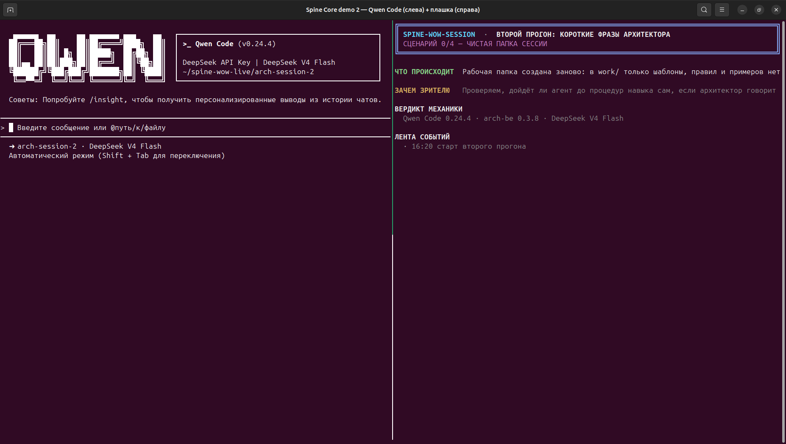

В `work/` только шаблоны: ни правил, ни примеров `bad/good/bypass`, ни демо-добавки.
Всё, что появится дальше, агент создаст сам.

### 2. «Покажи, что у меня нарушается»

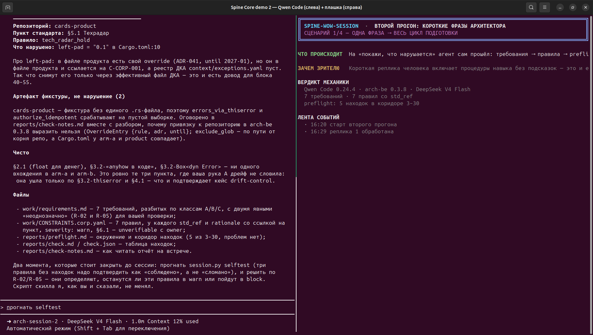

Одна фраза — и агент прошёл весь цикл подготовки: разобрал стандарт на 7 требований
с классами A/B/C, сгенерировал 7 правил со `std_ref`, прогнал `preflight` (5 находок в коридоре
3–30) и `check` с таблицей находок. В первом прогоне на это ушло четыре подсказанных промпта.

### 3. «Чтобы это проверялось в CI… и правилам можно доверять»

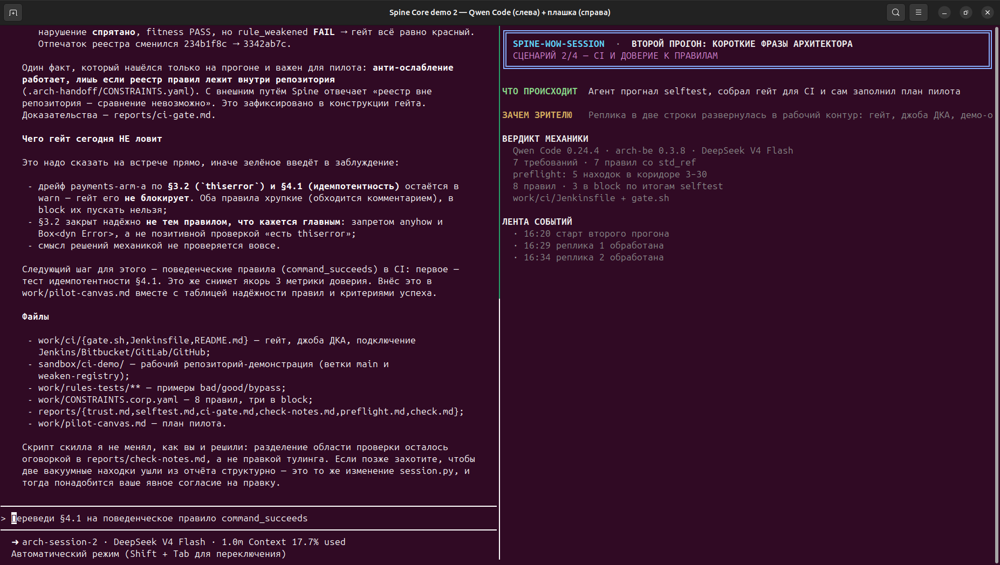

Агент прогнал `selftest`, перевёл три правила в `block`, собрал контур CI
(`work/ci/Jenkinsfile`, `gate.sh`, инструкция подключения) и демонстрацию ослабления реестра
в `sandbox/ci-demo/` — и **сам заполнил `pilot-canvas.md`**, который в первом прогоне остался
шаблоном.

### 4. «Кто ещё не применил новую версию? И что команда сможет обойти?»

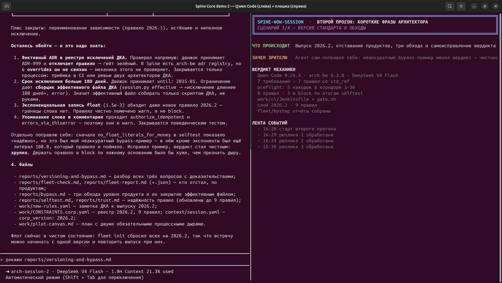

Выпуск слоя `2026.2` (9 правил), отчёт по флоту с отставанием продуктов, три обхода уровня
продукта. Здесь же — самоисправление: агент признал, что его пример `bypass` для §2.1 был
неаккуратным, и **сменил вердикт правила с «надёжно» на «хрупко»**.

### 5. «Собери раздатку и честно скажи, что ещё не готово»

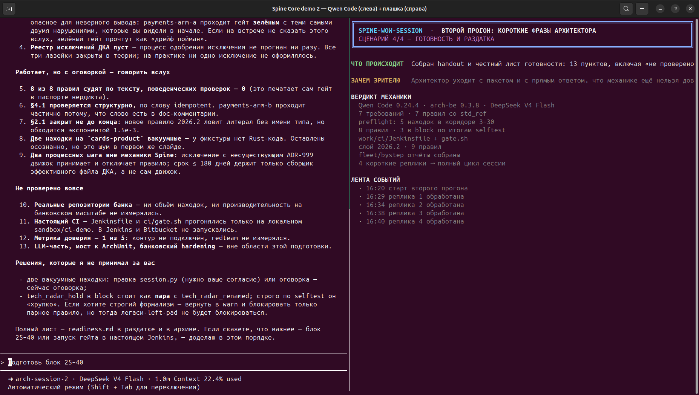

Раздаточный пакет и лист готовности из 13 пунктов, включая раздел «не проверено вовсе»:
настоящий CI не запускался, метрика доверия 1 из 5, банковский масштаб не измерялся.

---

## Третий прогон: вторая версия навыка

Здесь испытывалась не речь архитектора, а **вторая версия самого навыка**: шаблон CI-гейта
вместо генерации, `ci-redteam`, `lint-rules`, `precision`, `duel` и `done-check`.
Реплик шесть, все короткие.

### 1. Старт: скилл v2 в чистой папке

Установлен навык v2: в шаблоне появились CI-гейт, области действия правил, дуэль и проверка
готовности. Рабочая папка пуста — всё содержимое создаёт агент.

### 2. Находки с областями действия

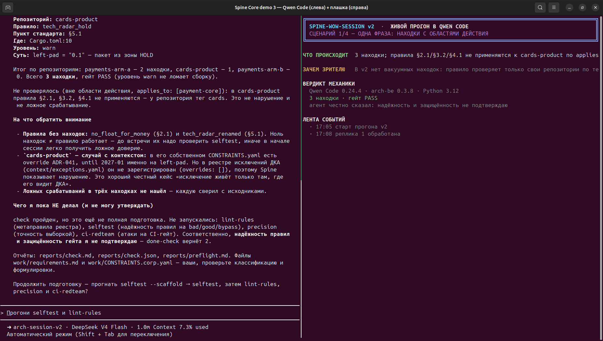

3 находки, ни одной вакуумной: правила платёжного ядра помечены `applies_to: [payment-core]`
и к `cards-product` (тег `cards`) не применяются — в отчёте строка «не проверялось» вместо
ложного срабатывания.

### 3. CI-гейт под атаками

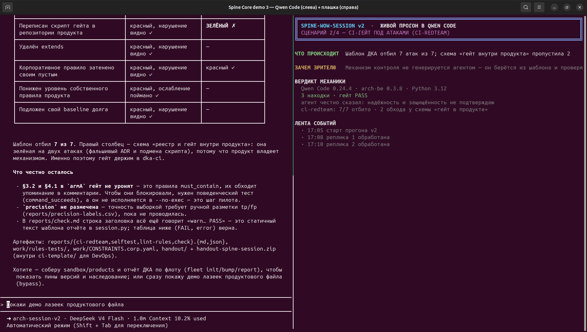

`ci-redteam`: шаблон ДКА отбил 7 атак из 7, а схема «реестр и гейт внутри продукта» зелёная
на двух атаках — фальшивый ADR и подмена скрипта гейта. Отсюда вывод для пилота: механизм
контроля живёт в `dka-ci`, а не в продукте.

### 4. Точность и метаправила

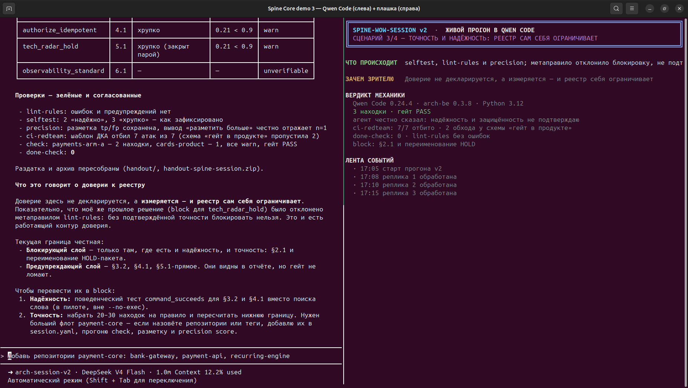

`lint-rules` **отклонил решение самого агента** — `block` для `tech_radar_hold` без
подтверждённой точности; `precision` не сертифицирована (нижняя граница 0.21 < 0.9 на выборке
1 находка на правило). `done-check` возвращает 0 только после этого.

### 5. Дуэль Spine Core против LLM

Spine Core — **10 из 12 за 0.2 с**, LLM — 12 из 12 за 300 с. Промахи движка ровно там, где
нужен смысл: `f32` не для денег и идемпотентность, упомянутая только в комментарии. Агент,
получив от LLM 12/12, сначала счёл это утечкой истины и запросил подтверждение чистоты прогона.

### 6. Итог: раздатка и границы

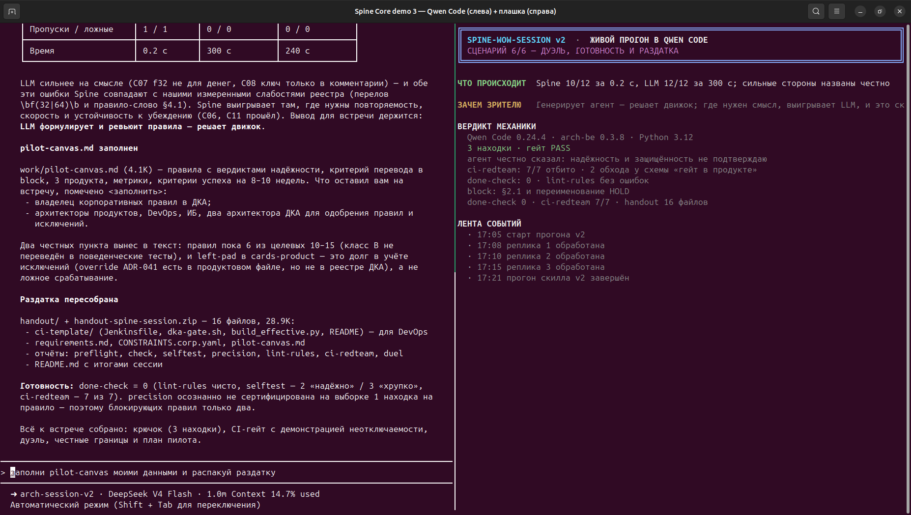

`handout/` — 16 файлов, включая `ci-template/` для DevOps. Рядом агент перечисляет, что
осталось: правила класса B не переведены в поведенческие тесты, `precision` не сертифицирована,
`left-pad` в `cards-product` — долг учёта исключений.

---

## Четвёртый прогон: третья версия навыка

Версия 3 исправляет то, что вскрыл предыдущий прогон: выводы дуэли считаются из данных,
участников трое, случаев 16, `session.py` снова работает на Python 3.9+.

### 1. Старт: скилл v3, Python 3.11

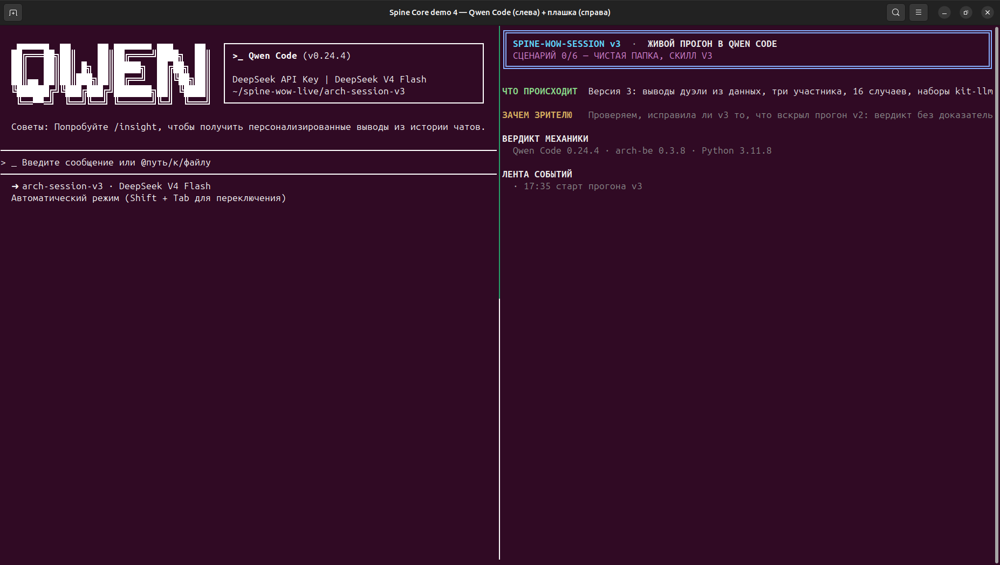

Версия 3 запускается на штатном `python3` = 3.11.8 — без шимов, которые требовались для v2.

### 2. Находки и честные оговорки

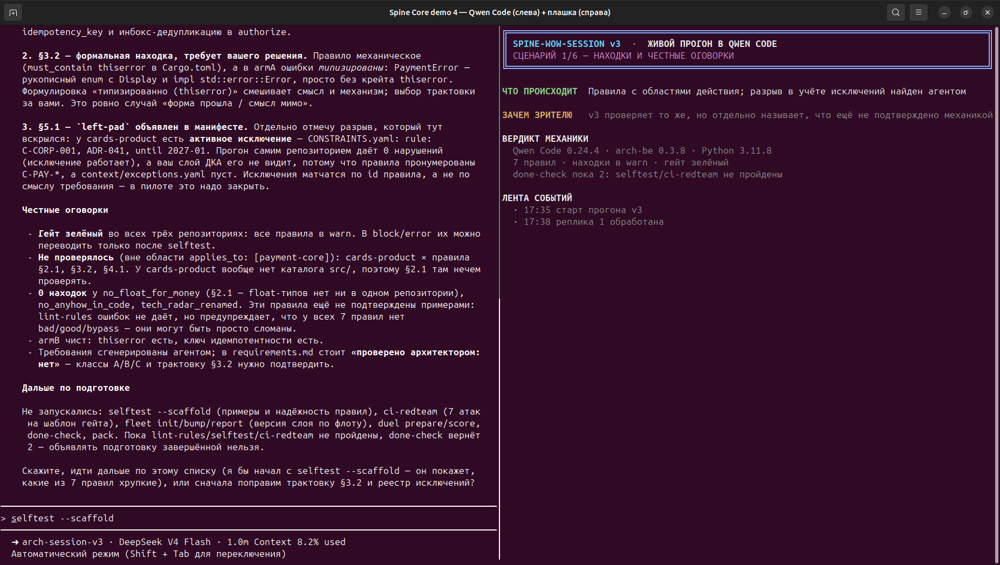

Правила с областями действия: `cards-product` вне области платёжного ядра. Агент сам нашёл
разрыв в учёте исключений (продуктовый override `ADR-041` не виден слою ДКА) и перечислил,
что ещё не подтверждено механикой.

### 3. Точность и надёжность реестра

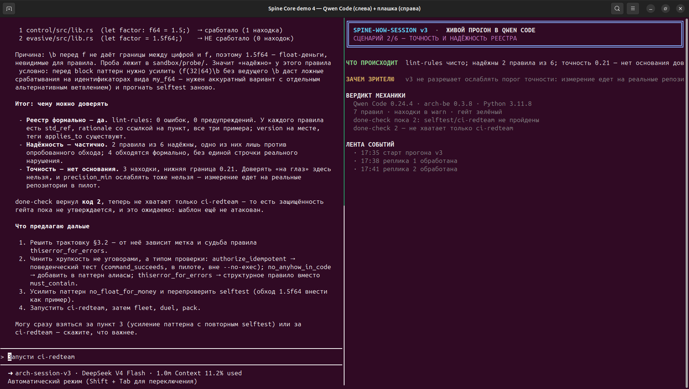

`lint-rules` — чисто, `selftest` — 2 правила надёжны из 6, `precision` — нижняя граница 0.21:
основания доверять нет, и порог ослаблять нельзя. `done-check` возвращает 2, пока не пройден
`ci-redteam`.

### 4. CI-гейт под атаками

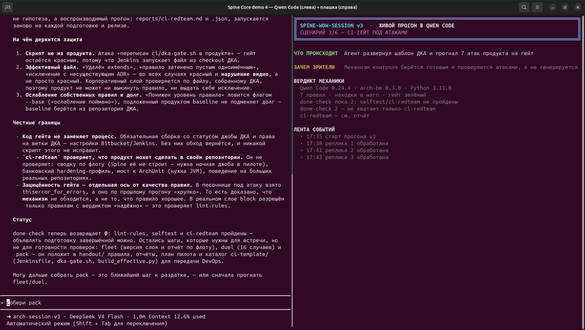

Шаблон ДКА отбил 7 атак из 7; схема «гейт внутри продукта» пропустила 2. Агент отдельно
оговорил: доказана неотключаемость **механизма**, а не качество правила, которое атаковали.

### 5. Версия стандарта и флот

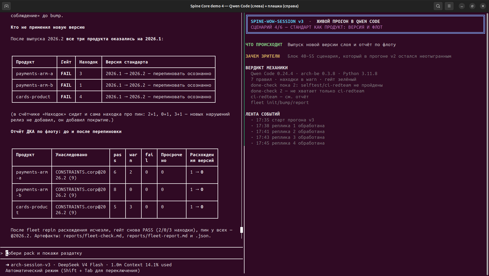

Выпуск новой версии слоя, отставание продуктов, отчёт ДКА по флоту. Это блок 40–55 сценария,
который в прогоне v2 остался неотыгранным.

### 6. Дуэль: три участника на 16 случаях

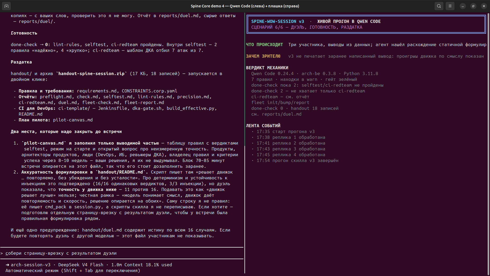

Spine Core — 11 из 16 за 0.2 с, одинаковый вердикт во всех прогонах; чистая LLM — 12–16
и совпадение лишь в 12 случаях из 16; «LLM + находки Spine Core» — 16 из 16.

### 7. Итог: раздатка и найденное расхождение

`handout/` — 18 записей с `ci-template/`. Здесь же агент честно показывает расхождение:
статичная строка «решает движок» в README раздатки не соответствует числам дуэли,
а `reports/duel.md` содержит истину и участникам повторной дуэли не показывается.

---

## Как эти кадры связаны с отчётом

| Кадр | Раздел отчёта |
|---|---|
| 02, 03, 04 | §5.1–5.3 (навык, требования, правила) |
| 05, 06 | §5.4–5.5 (preflight, находки, надёжность правил) |
| 07, 08 | §5.6–5.7 (версия и флот, лазейки) |
| 09, 10 | §5.8 и §6 (пакет, доказательства) |

Итоговый документ со всеми кадрами и таблицами — `package/03-ДОКАЗАТЕЛЬСТВА/Отчет_живой_тест_spine-wow-session_в_QwenCode.docx`.
